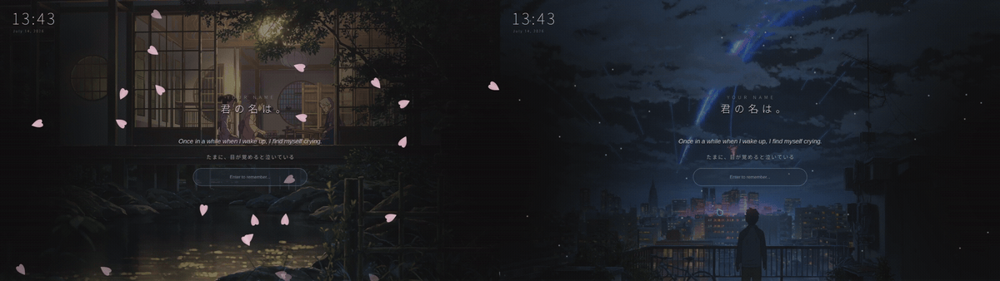
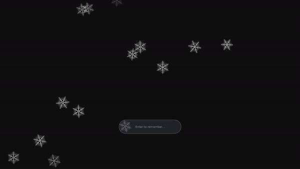
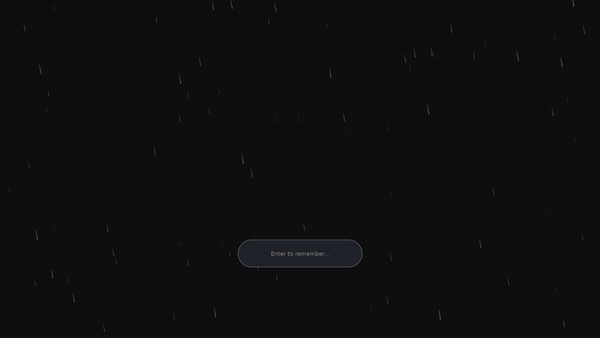
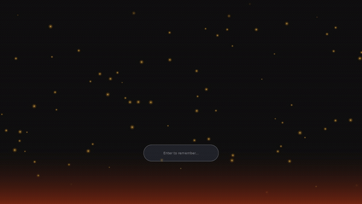
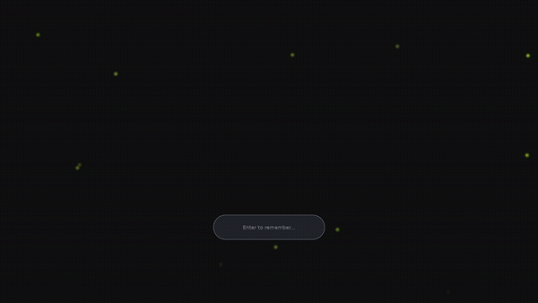
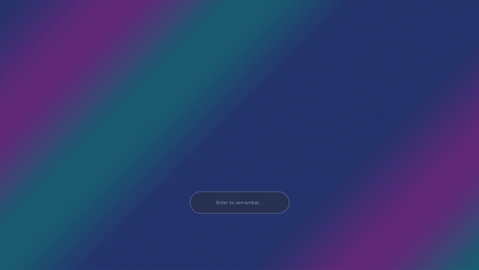
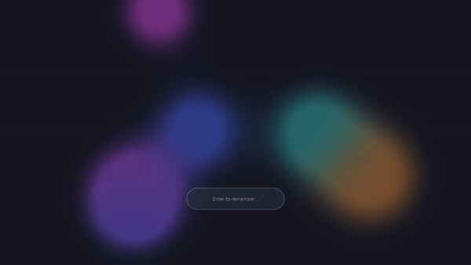
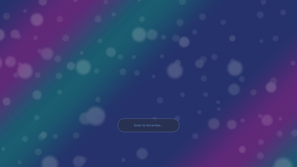

# veiland

**A GPU lock screen for Wayland that you compose from layers, each one a separate program.**

[](LICENSE)
[](https://github.com/sylflo/veiland/actions/workflows/ci.yml)

<!--
  hero.gif : THE shot. Raymarcher scene as a full lock screen with the
  password pill visible, so it reads as a locker, not a demo. Config:
  docs/examples/raymarcher.toml (has a [password] pill). GIF (not video)
  so it autoplays and loops natively on github.com; kept to 900px/10fps
  to hold the size down, since a full-screen shader is worst-case for GIF.
-->


Veiland (from "veil", something that obscures what's behind it) locks your
Wayland session and hands the *look* of the lock screen to plugins: small
programs that render into GPU buffers and hand them back over a socket.
Stack them, reorder them, swap them. The locker itself never has to change.
Pronounced "veil-land"; the resemblance to "Wayland" is deliberate, and
veiland is unaffiliated with the Wayland project.

## Why veiland

- **GPU-accelerated *and* extensible.** The whole lock screen is GPU-rendered,
  and you extend it with real plugins, not by shelling out to scripts. You
  don't have to fork veiland or send a PR to add one.
- **Plugins are isolated processes.** Every layer (wallpaper, particles,
  glow, clock) is a separate program, not code loaded into the locker. If
  one crashes or misbehaves, that layer disappears and the rest keeps
  running. None of them can read your password or touch the auth path.
- **Write your own on your own machine.** A plugin is just a program that
  talks to the core over a socket, so you drop one next to your config and
  point veiland at it. No rebuild of the locker, no upstream approval. The
  reference SDK is Rust today, but the wire format is documented
  ([`docs/protocol.md`](docs/protocol.md)) and not tied to Rust.
- **Stack layers into a scene.** Order plugins by `z_index` like layers in
  an image editor, target specific monitors, and animate them on the GPU at
  your refresh rate. Fourteen plugins ship in the box; see the
  [gallery](#gallery).

## Gallery

Every scene below is a ready-made config in [`docs/examples/`](docs/examples).
Copy one, set your wallpaper path, and lock.

| | | |
|---|---|---|
| <!-- gallery-shinkai.gif : flagship lived-with scene, wallpaper + vignette + particles + sakura + clock + labels. 5-8s loop, ~600px wide. Config: docs/examples/shinkai.toml --> <br>**[shinkai](docs/examples/shinkai.toml)**<br>two monitors, a different scene on each | <!-- gallery-sakura.gif : falling cherry blossoms over a dusk sky. 5-8s loop, ~600px. Config: docs/examples/sakura.toml --> <br>**[sakura](docs/examples/sakura.toml)**<br>falling petals | <!-- gallery-snow.gif : procedural six-fold ice crystals over a dark wallpaper. 5-8s loop, ~600px. Config: docs/examples/snow.toml --> <br>**[snow](docs/examples/snow.toml)**<br>dendritic crystals |
| <!-- gallery-rain.gif : wind-slanted motion-blur rain over a moody wallpaper. 5-8s loop, ~600px. Config: docs/examples/rain.toml --> <br>**[rain](docs/examples/rain.toml)**<br>slanted streaks | <!-- gallery-embers.gif : rising sparks + bottom glow over a dark wallpaper. 5-8s loop, ~600px. Config: docs/examples/embers.toml --> <br>**[embers](docs/examples/embers.toml)**<br>rising sparks | <!-- gallery-fireflies.gif : softly glowing wandering lights over a dark wallpaper. 5-8s loop, ~600px. Config: docs/examples/fireflies.toml --> <br>**[fireflies](docs/examples/fireflies.toml)**<br>wandering glow |
| <!-- gallery-gradient.gif : slow looping color ramp. 5-8s loop, ~600px. Config: docs/examples/gradient.toml --> <br>**[gradient](docs/examples/gradient.toml)**<br>flowing color ramp | <!-- gallery-blobs.gif : drifting metaball / lava-lamp field. 5-8s loop, ~600px. Config: docs/examples/blobs.toml --> <br>**[blobs](docs/examples/blobs.toml)**<br>lava-lamp metaballs | <!-- gallery-parallax.gif : three bokeh layers drifting over a gradient. 5-8s loop, ~600px. Config: docs/examples/parallax.toml --> <br>**[parallax](docs/examples/parallax.toml)**<br>layered bokeh depth |

**The full lineup:** wallpaper, clock, label, vignette, particles, sakura,
snow, rain, embers, fireflies, gradient, blobs, parallax, raymarcher.

## Quick start

**1. Install** (pick your distro):

<details>
<summary><strong>NixOS</strong> (flake module)</summary>

Add veiland as an input and import the module:

```nix
# flake.nix
{
  inputs.veiland.url = "github:sylflo/veiland";
}
```

```nix
# configuration.nix (with `inputs` in scope, e.g. via specialArgs)
{
  imports = [ inputs.veiland.nixosModules.default ];
  services.veiland.enable = true;
}
```

`services.veiland.enable = true` installs the `veiland` binary and the
reference plugins and registers the `veiland` PAM service for you. No manual
`/etc/pam.d/veiland` needed.

To try it without installing anything:

```sh
nix run github:sylflo/veiland
```

(Run outside NixOS, or before adding the module, this still needs the PAM
service. See [PAM setup](#pam-setup).)
</details>

<details>
<summary><strong>Arch Linux</strong> (AUR)</summary>

Install from the AUR (available from the `v0.1.0` release onward):

```sh
yay -S veiland        # or: paru -S veiland
```

The package installs the `veiland` binary and the reference plugins into
`/usr/bin` and registers the `veiland` PAM service. No manual
`/etc/pam.d/veiland` needed.

To build it yourself from this repo instead:

```sh
cd packaging/arch
makepkg -si
```
</details>

<details>
<summary><strong>Debian / Ubuntu</strong> (.deb)</summary>

Download the `.deb` from the [latest release][releases] and install it
(available from `v0.1.0` onward). `apt` pulls in the runtime libraries:

```sh
sudo apt install ./veiland_0.1.0-1_amd64.deb
```

The package installs the binaries into `/usr/bin` and bundles
`/etc/pam.d/veiland`, so PAM works out of the box. Built for Debian 13
(trixie) and newer, and Ubuntu 24.04 and newer.

To build the `.deb` yourself from this repo:

```sh
cp -r packaging/debian debian
dpkg-buildpackage -b -us -uc
sudo apt install ../veiland_*.deb
```
</details>

<details>
<summary><strong>Fedora / RHEL</strong> (.rpm)</summary>

Install the `.rpm` straight from the [latest release][releases]
(available from `v0.1.0` onward); `dnf` resolves the runtime deps:

```sh
sudo dnf install https://github.com/sylflo/veiland/releases/latest/download/veiland-0.1.0-1.x86_64.rpm
```

The package installs the binaries into `/usr/bin` and bundles
`/etc/pam.d/veiland`. To build the `.rpm` yourself, see
`packaging/README.md`.
</details>

<details>
<summary><strong>From source</strong></summary>

Linux only. Requires `pkg-config`, Mesa (libgbm, libEGL, libGLESv2),
libdrm, libpam, and a Wayland compositor implementing `ext-session-lock-v1`.

```sh
cargo build --release
```

The flake's dev shell provides every build dependency:

```sh
nix develop      # drops you into a shell with the full toolchain
```

A source build does **not** set up PAM. You must create
`/etc/pam.d/veiland` yourself. See [PAM setup](#pam-setup).
</details>

[releases]: https://github.com/sylflo/veiland/releases

**2. Grab a scene.** The `sakura` example needs only its bundled wallpaper:

```sh
mkdir -p ~/.config/veiland
cp docs/examples/sakura.toml            ~/.config/veiland/config.toml
cp docs/examples/assets/sakura-dusk.jpg ~/.config/veiland/
```

Then edit `~/.config/veiland/config.toml` and set the wallpaper `path` to an
**absolute** path (no `~`):

```toml
[[plugin]]
name = "wallpaper"
binary = "veiland-wallpaper"
z_index = -100
[plugin.config]
path = "/home/you/.config/veiland/sakura-dusk.jpg"
```

**3. Lock:**

```sh
veiland
```

Bind that to a key or an idle daemon (`hypridle`, `swayidle`). If the
wallpaper path is wrong it's harmless: the petals, clock, and password pill
still render over black, and veiland logs the bad path. Every scene in the
[gallery](#gallery) installs the same way.

---

## Architecture

Veiland-core owns the lock surface, handles keyboard input and PAM, and
composites the final image. It spawns each plugin as a child process.
Plugins render into their own GPU buffers and hand back a file descriptor,
which the core samples as a texture. No pixel data crosses CPU memory, and
no plugin ever sees a keystroke.

```
                      +--------------------------------------+
                      |  veiland-core (trusted)              |
   keyboard  ------>  |  input, password buffer, PAM,        |
                      |  unlock decision, GL compositing     |
                      +------------------+-------------------+
                                         |  Unix socket (SEQPACKET)
             +---------------------------+---------------------------+
             |                           |                           |
      +------+------+             +------+------+             +------+------+
      |  wallpaper  |             |   sakura    |             |    clock    |  ...
      | (untrusted) |             | (untrusted) |             | (untrusted) |
      +------+------+             +------+------+             +------+------+
             |  dmabuf fd                |  dmabuf fd                |  dmabuf fd
             +---------------> (SCM_RIGHTS, zero-copy) <-------------+
```

Each plugin connects over the socket, allocates GPU buffers via GBM, renders
into them with its own EGL/OpenGL context, and sends the buffer file
descriptors to the core via `SCM_RIGHTS`. The core imports the fds as
`EGLImage` textures and composites them. All security-critical operations
(input handling, the password buffer, PAM, the unlock decision) run in the
trusted core; plugins are untrusted and sandboxed by the process boundary,
so the kernel enforces both crash isolation and memory isolation for free.

The locker is in production and works end to end: an `ext-session-lock-v1`
lock surface, PAM authentication, a configurable password indicator,
process-isolated GPU plugins over DMA-BUF, multi-monitor support with
per-plugin output targeting, and HiDPI-aware text rendering via
`veiland-text` (cosmic-text backend).

Full write-up, trust boundaries, module map, and the wire format:
[`docs/architecture.md`](docs/architecture.md) and
[`docs/protocol.md`](docs/protocol.md).

## Security model

Two boundaries do the work: the compositor enforces the lock, and the process boundary contains the plugins.

**The session fails closed.** Under [`ext-session-lock-v1`](https://wayland.app/protocols/ext-session-lock-v1), the compositor, not veiland, enforces the lock. The spec is explicit: *"if the client dies while the session is locked, the compositor must not unlock the session in response."* If veiland crashes, the session stays locked and no window content is ever revealed; the worst case is a locked screen you recover from a TTY. That guarantee comes from the compositor, not from veiland being bug-free.

**Plugins sit outside the trust boundary.** The compositor unlocks whenever the lock client asks it to, so what matters is what runs inside that client. In veiland, plugins don't: they are separate processes, not loadable modules, and the protocol between them and the core is deliberately narrow.

- **They cannot read your password.** It lives in `mlock`'d memory in the core process, is zeroed after each PAM call, and never appears in any buffer a plugin can see. No protocol message carries keyboard input in either direction; plugins never receive keystrokes at all.
- **They cannot trigger an unlock.** No plugin-to-core message maps to "unlock". The API surface is absent, not filtered.
- **They cannot execute code in the core.** A plugin hands over GPU buffers; bytes in a buffer become pixel values through a GPU sampler, never instructions. Every field a plugin sends is validated before it reaches EGL or the kernel; implausible sizes, strides, and modifiers are refused.

**What a hostile plugin can still try, and how it's bounded.** Malformed messages or resource exhaustion get its socket closed and a fallback drawn for its region; in-flight buffers and dimensions are capped, and the locker never blocks on a dead plugin. A plugin could draw a fake "unlocked" desktop inside its own region, which is why the password UI is painted by the core on top of all plugin output: a plugin can draw beneath it, never over it.

## Configuration

Veiland looks for its config at `~/.config/veiland/config.toml` (or
`$XDG_CONFIG_HOME/veiland/config.toml`). See `docs/config.md` for the full
reference. A minimal config:

```toml
[password]
position = "center"

[[plugin]]
name = "wallpaper"
binary = "veiland-wallpaper"
z_index = 0
[plugin.config]
path = "/home/you/Pictures/wallpaper.jpg"

[[plugin]]
name = "clock"
binary = "veiland-clock"
z_index = 1
```

Each plugin's `binary` is a **bare name**: veiland resolves it beside the
installed `veiland` binary (then on `$PATH`), so the same config works
whether your distro installs to `/usr/bin` or, on NixOS, a
`/nix/store/.../bin` directory. To run a specific build instead, give a path
containing a `/` (e.g. `target/debug/veiland-clock`) and it's used verbatim.
Plugin **asset** paths like the wallpaper's `path`, though, are read
directly with no `~` expansion, so always give those an absolute path.

Plugins layer by `z_index` (low to high), and a `monitors = ["DP-1"]` key
targets specific outputs. That's how a scene can run one wallpaper on one
monitor and a different one on another. The example configs in
[`docs/examples/`](docs/examples) are the fastest way to see the full config
surface; `shinkai.toml` composes seven plugins across two monitors.

## Plugin development

Plugins are standalone programs that speak the veiland protocol over a Unix
socket. The reference SDK is `veiland-plugin` (Rust), but the wire format is
documented in `docs/protocol.md` and isn't tied to Rust.

A minimal plugin:

```rust
use veiland_plugin::{Connection, DmaBuffer, Frame, FramePacer};

fn main() -> anyhow::Result<()> {
    let mut conn = Connection::connect("my-plugin", env!("CARGO_PKG_VERSION"))?;
    let cfg = match conn.wait_for_configure()? {
        Some(c) => c,
        None => return Ok(()),
    };
    // allocate a DMA-BUF at the configured region size, set up GL ...
    let mut pacer = FramePacer::self_paced();
    loop {
        match pacer.next(&mut conn)? {
            Frame::Render => {
                // render, then:
                conn.send_buffer(&buf_msg, dmabuf_fd, fence)?;
                pacer.submitted();
            }
            Frame::Reconfigure(c) => { /* update scale/size */ }
            Frame::Shutdown => return Ok(()),
        }
    }
}
```

See `docs/plugin-api.md` for the full API reference, including how to load
image assets and write procedural shader plugins.

## Compatibility

Targets any compositor implementing `ext-session-lock-v1`. Tested primarily
on Hyprland and Sway.

Other compositors implementing the protocol (KDE Plasma, niri, Wayfire,
river, and other wlroots-based compositors) should work but are not
regularly tested. GNOME's support for `ext-session-lock-v1` has historically
been partial, so treat it as untested.

## Design principles

1. **Process isolation is non-negotiable.** A crashing or malicious plugin
   must not compromise the locker.
2. **OpenGL only.** Vulkan's complexity buys nothing for compositing a
   handful of textured quads.
3. **The plugin API is a one-way door.** Versioning and capability
   negotiation are built in from day one.

## Non-goals

- X11 support. Wayland-only by design.
- Cross-platform. Linux-only, because DMA-BUF and GBM are Linux-specific.
- Vulkan plugins.
- Hot-reloading plugins without restart.
- A built-in plugin store.

Veiland does password authentication only for now: it feeds the typed
password to PAM. Fingerprint and hardware-token support, and pointer-driven
widgets, aren't in this release; they're plausible additions if there's
demand. There is no video playback.

## PAM setup

Veiland authenticates against the PAM service named `veiland`, so
`/etc/pam.d/veiland` must exist. Veiland only performs the `auth` and
`account` phases (verify the password, check the account is valid); it does
not open a session, so the config is minimal.

The **distro packages** (Arch/Debian/Fedora, above) bundle this file, so if
you installed one of them there is nothing to do here.

On **NixOS**, the [flake module](#quick-start) handles this. If you install
the package some other way, add:

```nix
security.pam.services.veiland = {};
```

For a **source install on other distributions**, create `/etc/pam.d/veiland`
referencing the system auth stack. Most distributions (Arch, Fedora,
openSUSE):

```
auth     include system-auth
account  include system-auth
```

Debian/Ubuntu use `common-auth` / `common-account` instead:

```
auth     include common-auth
account  include common-account
```

This inherits the system's password policy and stays correct as that policy
changes, the standard approach for a screen locker's PAM stack. Any
interactive lines the include pulls in (fingerprint, hardware tokens) are
inert for veiland: it does password authentication only.

## References

The Linux GPU stack (GBM, EGL, dmabuf import) is sparsely documented. Useful
starting points:

- [`kmscube`](https://gitlab.freedesktop.org/mesa/kmscube), canonical GBM + EGL example.
- [`wlroots`](https://gitlab.freedesktop.org/wlroots/wlroots), production-quality GBM + EGL + dmabuf import. See `render/gles2/` and `render/allocator/gbm.c`.
- [`EGL_EXT_image_dma_buf_import`](https://registry.khronos.org/EGL/extensions/EXT/EGL_EXT_image_dma_buf_import.txt), the load-bearing EGL extension.
- [`ext-session-lock-v1`](https://wayland.app/protocols/ext-session-lock-v1), the Wayland protocol veiland uses to lock the screen.

## License

GPL-3.0-or-later. See [`LICENSE`](LICENSE).

Plugins communicate with the core over a Unix socket, so plugin authors are
free to license their plugins under any terms.
</content>
